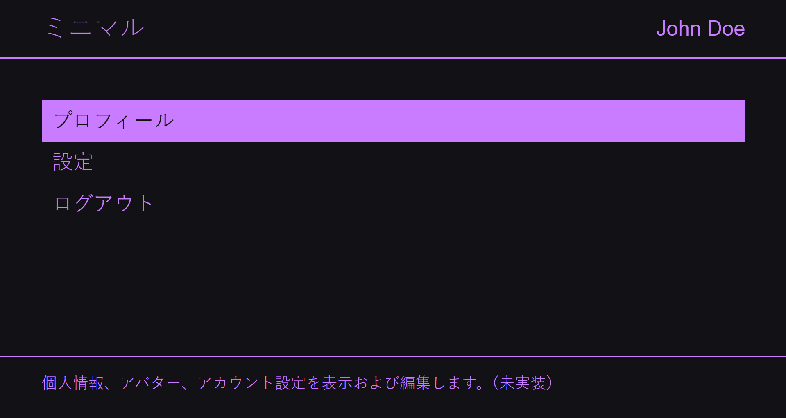

# Minimal

[🌐 Live demo](https://minimal-e0cfc.web.app/)

**Minimal** is my personal pet project — an experiment in building an unusually minimal, accessible web app using Angular. The goal is to explore accessibility, theming, and internationalization.

## Themes

- ☀️ Light
- 🌙 Dark
- 🟢 Green
- 🟣 Purple

## Languages

- 🇬🇧 English
- 🇷🇺 Russian
- 🇨🇳 Chinese
- 🇯🇵 Japanese
- 🇳🇴 Norwegian
- 🇮🇱 Hebrew
- 🇵🇱 Polish
- 🇪🇸 Spanish

## Tech

- Angular 19 (zoneless)
- Angular Material
- Tailwind CSS
- SignalStore
- Playwright
- Firebase Hosting

_Just a coding experiment_
